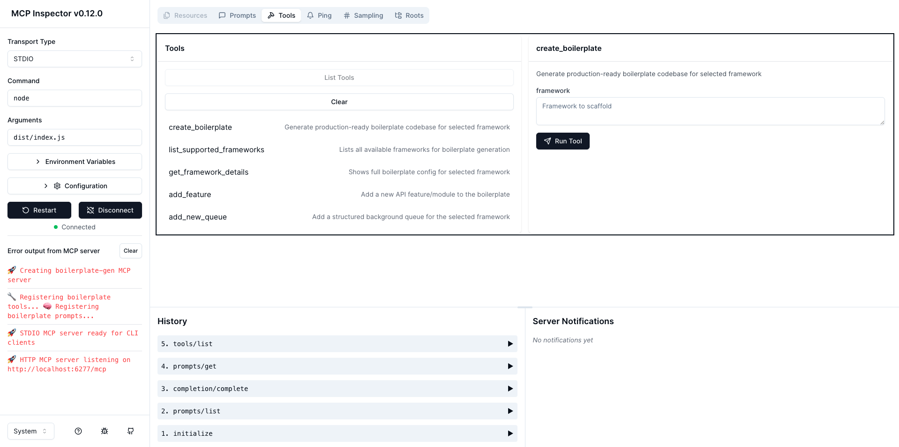
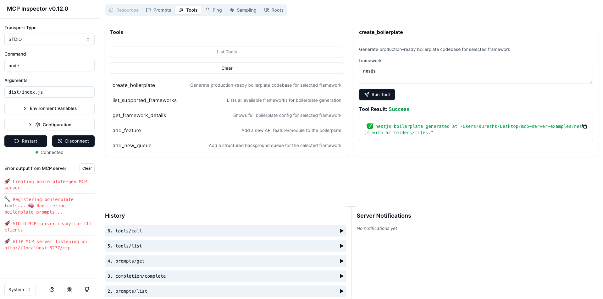
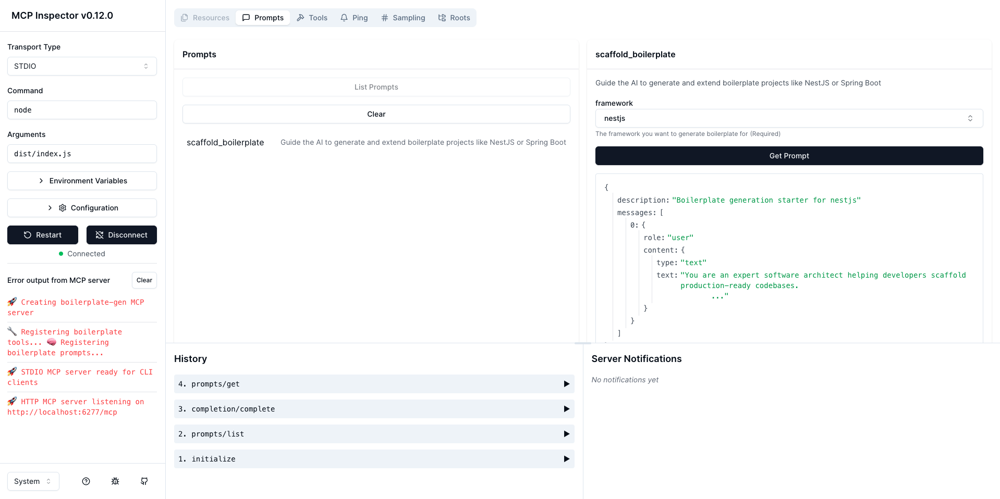

# 🧱 Boilerplate Generator MCP Server

This MCP agent helps developers generate **production-ready boilerplates** for common backend frameworks like **NestJS** and **Spring Boot**.
It supports CLI-based interaction using the **STDIO transport**, allowing it to be used via command-line tools or MCP Inspector (in STDIO mode).

> Built using [Model Context Protocol TypeScript SDK](https://github.com/modelcontextprotocol/typescript-sdk)

---

## 🚀 Features

* 📦 Generate full project structure for NestJS or Spring Boot
* ➕ Add new REST API feature modules
* 🧵 Add background queue handlers
* 📂 Configurable folder structure, file responsibilities, and recommended packages
* ⚙️ Extensible for other frameworks (Next.js, React Native, etc.)

---

## 📦 Prerequisites

* **Node.js** `>=18.x`
* MCP Inspector (for testing) or any STDIO-compatible client

---

## 🛠 Installation

```bash
git clone https://github.com/sur950/mcp-server-examples.git
cd mcp-server-examples

npm install
```

---

## ▶️ Running the Server

1. Start the STDIO-based MCP server:

    ```bash
    npm run dev
    ```

2. Open a second terminal and run:

    ```bash
    npm run debug
    ```

Then open:

👉 `http://127.0.0.1:6274` in your browser
Select `STDIO` as transport → Command: `node`, Arguments: `dist/index.js`

> This connects the `boilerplate-gen` MCP server using STDIO.

---

## 🧪 Example Usage via MCP Inspector

### 🛠 List of Tools



### 🧭 Running `create_boilerplate`



### 🧱 Running `scaffold_boilerplate` prompt



---

## 🧰 Tools

| Tool Name                   | Description                                     |
| --------------------------- | ----------------------------------------------- |
| `create_boilerplate`        | Scaffold an initial project with structure/docs |
| `list_supported_frameworks` | View supported frameworks                       |
| `get_framework_details`     | View structure, packages, file conventions      |
| `add_feature`               | Add new API module (controller/service/dto)     |
| `add_new_queue`             | Add background queue (processor, events, etc.)  |

---

## 💬 Prompt

| Prompt Name               | Description                              |
| ------------------------- | ---------------------------------------- |
| `scaffold_boilerplate` | Guides the LLM through setup and choices |

---

## 📁 Internal Structure

```bash
boilerplate-gen/
├── config.ts      # Config for frameworks, structure, package choices
├── prompt.ts      # Prompt handler for LLM-driven scaffolding
├── server.ts      # MCP server with STDIO transport
├── tools.ts       # CLI-style tools: create, add_feature, add_queue
├── README.md
└── assets/        # Demo screenshots
```
