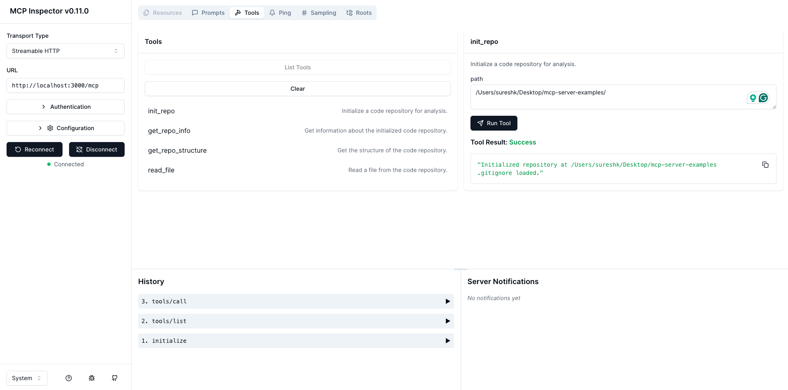
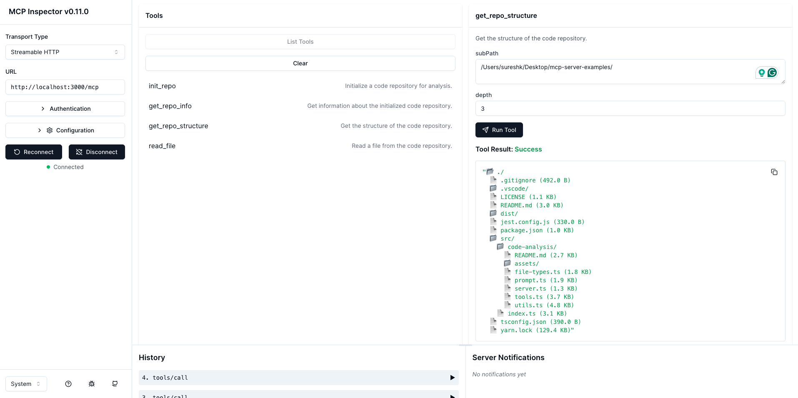

# 🧠 Code Analysis MCP Server

This is a modular MCP agent for **analyzing local code repositories**.  
It exposes tools to inspect a project’s file structure, read files (with language detection), and guide the user through code exploration via structured prompts.

> Powered by [Model Context Protocol TypeScript SDK](https://github.com/modelcontextprotocol/typescript-sdk) with `Streamable HTTP` as Transport Type.

---

## 🚀 Features

- 🗂️ Initializes and inspects code repositories (with `.gitignore` support)
- 📁 Traverses directory trees with depth control
- 📄 Reads file content (up to 1MB / 1000 lines)
- 💬 Provides prompt-guided codebase analysis for LLMs
- ✅ Fully compatible with [MCP Inspector](https://github.com/modelcontextprotocol/inspector)

---

## 📦 Prerequisites

- **Node.js** `>= 18.x`
- MCP-compatible client (e.g., MCP Inspector)
- Local repo access via allowed `roots`

---

## 🛠 Installation

```bash
git clone https://github.com/sur950/mcp-server-examples.git
cd mcp-server-examples

npm install
```

---

## ▶️ Running the Server

1. Start the MCP server:

    ```bash
    npm run dev
    ```

2. Open a second terminal and run:

    ```bash
    npm run debug
    ```

This opens the **MCP Inspector UI** at `http://127.0.0.1:6274`.

---

## 🧪 Example Usage via MCP Inspector

### 🛠 List of Tools


### 🧭 Running `init_repo`



### 🧱 Running `get_repo_structure`



---

## 🛠 Tools

| Tool                 | Description                                |
| -------------------- | ------------------------------------------ |
| `init_repo`          | Initialize a repo path (must be allowed)   |
| `get_repo_info`      | Return `.gitignore` and path details       |
| `get_repo_structure` | Show directory tree by depth/subpath       |
| `read_file`          | Read file contents with language detection |

---

## 💬 Prompt

| Prompt                    | Description                            |
| ------------------------- | -------------------------------------- |
| `analyze_code_repository` | Guided exploration of repo for LLM use |

The prompt walks the LLM through:

- Initialization → Structure → File reading
- Forming and verifying hypotheses
- Producing structured, evidence-based conclusions

---

## 📁 Internal Folder Structure

```bash
code-analysis/
├── tools.ts       # Tool implementations (init, structure, file)
├── prompt.ts      # Prompt definition for LLM agents
├── utils.ts       # Gitignore parsing, reader helpers
├── server.ts      # MCP server with registration logic
└── README.md      # This file
```
